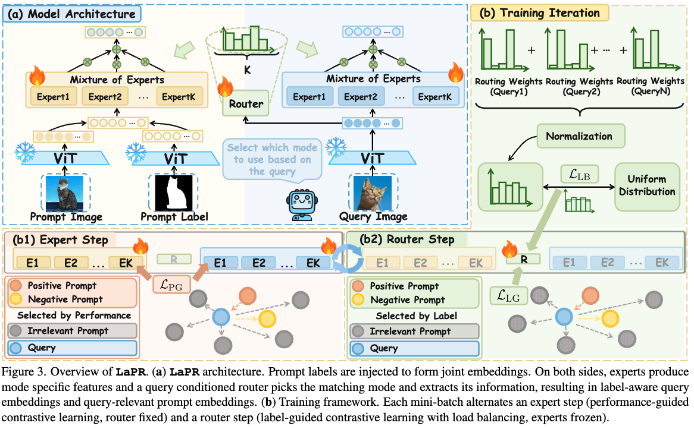
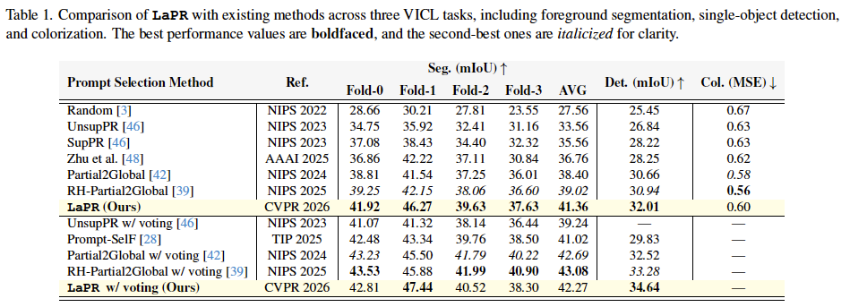
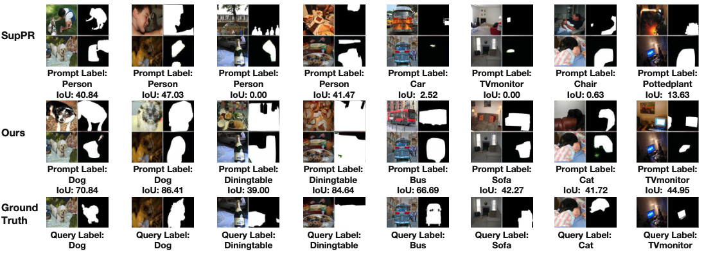

# Love Me, Love My Label - Rethinking the Role of Labels in Prompt Retrieval for VICL

## 1. Introduction

This is the implementation of our work at **CVPR2026**😊:

> [**Love Me, Love My Label - Rethinking the Role of Labels in Prompt Retrieval for VICL**](https://arxiv.org). Tianci Luo<sup>\*</sup>, Haohao Pan<sup>*</sup>, Jinpeng Wang, Niu Lian, Xinrui Chen, Bin Chen, Shu-Tao Xia, Chun Yuan.

<p align="center">
  
</p>
We propose LaPR, a label-aware prompt retrieval framework for Visual In-Context Learning. By explicitly incorporating label cues into prompt representations and introducing query-adaptive expert routing, LaPR selects more label-consistent prompts and improves retrieval quality, leading to stronger and more robust VICL performance across diverse tasks.

---

## 2. Environment & Requirements

- Python 3.8
- PyTorch 1.12.1
- cuda 11.6

```bash
git clone https://github.com/luotc-why/CVPR26-LaPR.git
cd CVPR26-LaPR
conda create -n LaPR python=3.8 -y
conda activate LaPR
conda install pytorch==1.12.1 torchvision==0.13.1 torchaudio==0.12.1 cudatoolkit=11.6 -c pytorch -c conda-forge
cd VICL
pip install -r requirements.txt
````

---

## 3. Datasets & Pre-Trained MAE-VQGAN Weights

### 3.1 Preparing Datasets

Download following datasets:

> #### 1. PASCAL-5<sup>i</sup>
>
> Download PASCAL VOC2012 devkit (train/val data).

> #### 2. ImageNet
>
> Download ImageNet-1K ILSVRC2012 train/val images and annotations.

Create a directory '../LaPR_Data' for the above two datasets and appropriately place each dataset to have following directory structure:

```text
LaPR/
├── CVPR26-LaPR/                    # this repo
└── LaPR_Data/
    ├── figures_dataset/
    │   ├── imagenet/           # (dir.) contains 1000 object classes
    │   │   ├── test_data
    │   │   ├── test_label
    │   │   ├── train_data
    │   │   └── train_label  
    │   └── pascal-5i/VOC2012            # PASCAL VOC2012 devkit
    │       ├── Annotations/
    │       ├── ImageSets/
    │       ├── ...
    │       └── SegmentationClassAug/
    ├── splits/pascal/
    └── weights/
        ├── vqgan/
        │   ├── last.ckpt
        │   └── model.yaml
        ├── checkpoint-1000.pth
        ├── checkpoint-3400.pth
        └── visual_prompt_retrieval/
```

You can freely adjust paths as long as they match the arguments in the provided scripts.

### 3.2 Downloading Pre-Trained MAE-VQGAN Weights

Please follow [Visual Prompting](https://github.com/amirbar/visual_prompting) to prepare model and download the ```CVF 1000 epochs``` and  ```CVF 3400 epoch``` pre-train checkpoint. We use ```CVF 1000 epochs``` to solve the coloring task, and use ```CVF 3400 epoch``` to solve the segmentation and detection task.

**We use the segmentation task as an example to illustrate the specific workflow.**

## 4. Label-Aware Prompt Retrieval (Segmentation)

### 4.1 Stage I: Build label-aware retriever (training)

#### Step 1 – Extract image features for training prompts

Use an off-the-shelf backbone to encode all training images in PASCAL-5<sup>i</sup>:

```bash
python tools/featextrater_folderwise_UnsupPR.py vit_large_patch14_clip_224.laion2b features_vit-laion2b trn data_base_path
```

This will create a folder such as `features_vit-laion2b_trn/` that stores features for all training images.

#### Step 2 – Compute similarity within the training pool

```bash
python tools/calculate_similariity.py features_vit-laion2b trn trn data_base_path
```

This script generates the retrieval list among training samples and saves it as JSON files.

#### Step 3 – UnsupPR VICL evaluation

Before training LaPR, you need evaluate the current retriever as a reference:

```bash
python evaluate/evaluate_segmentation.py
```

The script will read the similarity files from Step 2 and report VICL segmentation metrics.

#### Step 4 – Label matching evaluation

We prepare the label matching score for measuring positive and negative pairs:

```bash
python evaluate/label_matching_segmentation.py
```

#### Step 4 – Mine positive/negative pairs and train LaPR

First, mine positive and negative pairs based on VICL performance and label matching:

```bash
python tools/get_positive_negative.py features_vit-laion2b_trn output_vit-laion2b-clip_trn

python tools/get_positive_negative_label_matching.py features_vit-laion2b_trn output_vit-laion2b-clip_trn
```

Then, train the LaPR retriever with supervised contrastive learning and Mixture-of-Experts routing:

```bash
cd ../SupContrast
python main_supcon_moe_moe.py \
    --batch_size 64 \
    --learning_rate 0.005 \
    --epochs 200 \
    --temp 0.1 \
    --dataset path \
    --data_base_path ${data_root} \
    --data_folder ${data_root}/figures_dataset/pascal-5i/VOC2012/JPEGImages \
    --seed 0 \
    --folder_id 0 \
    --cosine \
    --pretrain
```

* `data_root` should point to your `Data` directory.
* `folder_id` controls the PASCAL-5<sup>i</sup> split.

---

### 4.2 Stage II: VICL Segmentation with LaPR

After training, we use the learned label-aware retriever for VICL.

#### Step 1 – Extract features with the LaPR retriever

For validation queries:

```bash
python tools/featextrater_folderwise_SupMoEPR_XY.py vit_large_patch14_clip_224.laion2b features_supcon-vit-laion2b-clip-csz224-bsz64-lr0005-freeze-encoder val ${data_root} 0.005 ckpt_epoch_200 0 0 
```

For training/support images:

```bash
python tools/featextrater_folderwise_SupMoEPR_XY.py vit_large_patch14_clip_224.laion2b features_supcon-vit-laion2b-clip-csz224-bsz64-lr0005-freeze-encoder trn ${data_root} 0.005 ckpt_epoch_200 0 0
```

#### Step 2 – Compute similarity with LaPR

```bash
python tools/calculate_similariity_SupMoE_XY.py features_supcon-vit-laion2b-clip-csz224-bsz64-lr0005-freeze-encoder val trn ${data_root} 0.005 ckpt_epoch_200 0 0 
```

This produces query-to-prompt similarity files using the MoE-based label-aware representation.

#### Step 3 – Evaluate segmentation

```bash
python evaluate/evaluate_segmentation.py --model mae_vit_large_patch16 --base_dir ${data_root} --feature_name features_supcon-vit-laion2b-clip-csz224-bsz64-lr0005-freeze-encoder_val --output_dir ${data_root}/cross_0_output_seg_images/moe_moe_segmentation_epoch-200/output_supcon-vit-laion2b-clip-csz224-bsz64-lr0005-freeze-encoder_val_XY_folder0_seed0 --ckpt ${data_root}/weights/checkpoint-3400.pth --fold 0 --seed 0 --top_50_path ${data_root}/figures_dataset/pascal-5i/VOC2012/features_supcon-vit-laion2b-clip-csz224-bsz64-lr0005-freeze-encoder_val_MoE_final_XY_lr_0.005_epoch_ckpt_epoch_200_from_folder0/folder0_top50-similarity.json 
```

---

## 5. Performance

Our method consistently boosts visual in-context learning across segmentation, detection, and colorization.

<p align="center">
  
</p>


---

## 6. Qualitative Visualizations

We also visualize LaPR’s behavior, including retrieval quality and downstream predictions, to better understand how label awareness influences prompt selection.

<p align="center">
  
</p>

---

## 7. Acknowledgements

We are also grateful for other teams for open-sourcing codes that inspire our work, including [Visual Prompting](https://github.com/amirbar/visual_prompting), [visual_prompt_retrieval](https://github.com/ZhangYuanhan-AI/visual_prompt_retrieval), [timm](https://github.com/huggingface/pytorch-image-models), [ILM-VP](https://github.com/OPTML-Group/ILM-VP), [InMeMo](https://github.com/Jackieam/InMeMo).

## 8. Contact

If you have any question, you can raise an issue or email Tianci Luo (ltc25@mails.tsinghua.edu.cn). We will reply you soon.